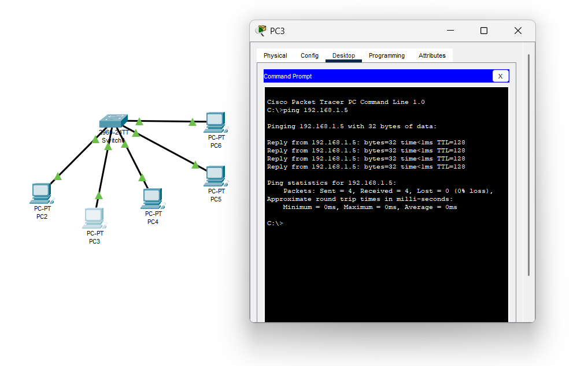
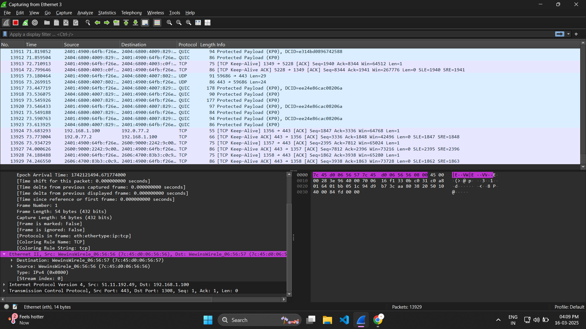
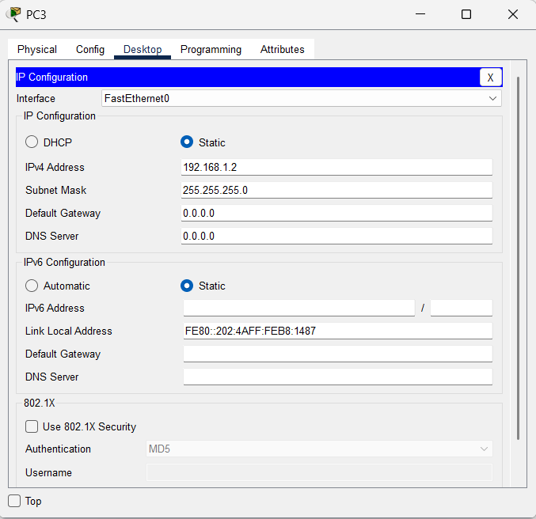
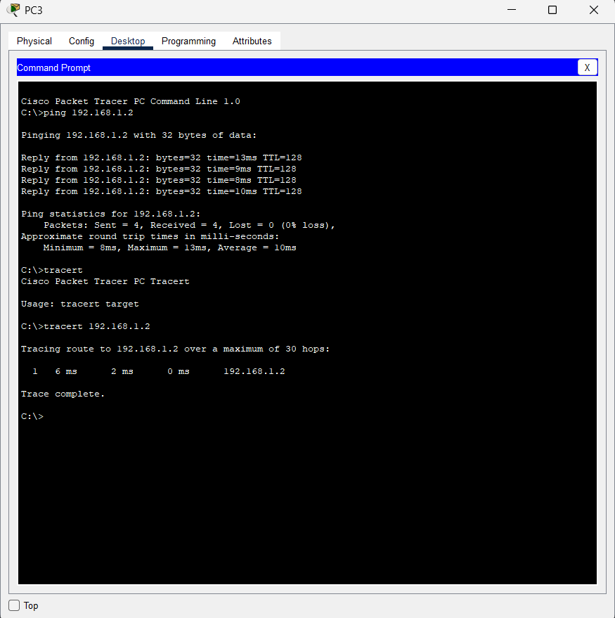
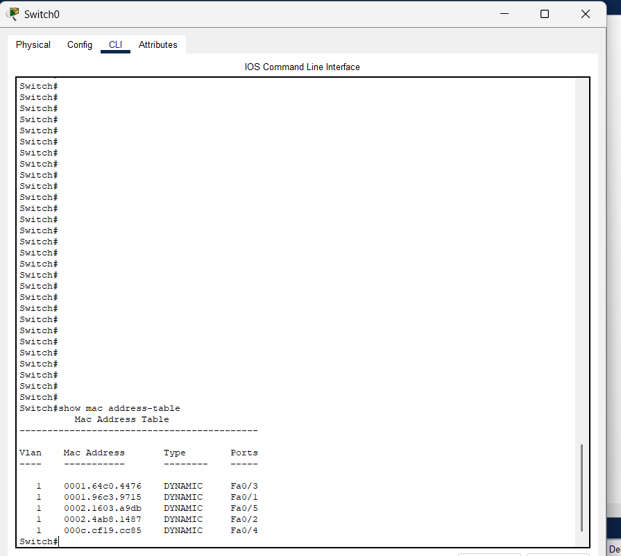
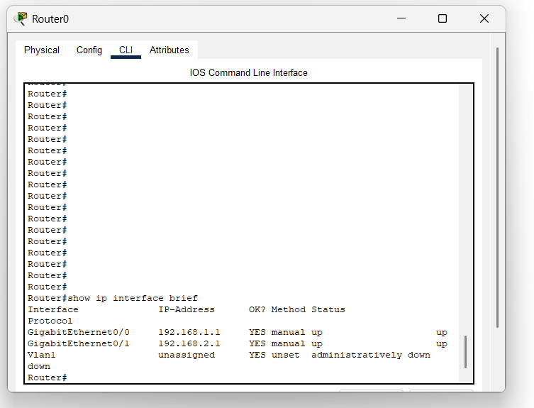

# Network Assignment - 3 & 4

#### Shiva Raama Krishna.K

#### Mepco Schlenk Engineering College

#### Dept. of Computer Science and Engineering

## Question - 01

### Simulate a small network with switches and multiple devices. Use ping to generate traffic and observe the MAC address table of the switch. Capture packets using Wireshark to analyze Ethernet frames and MAC addressing.

### Simulation of Small Network with Multiple devices

I have simulated a small local network, connecting 5 PC's to a switch. IP's has been allocated manually and traffic has been generated using using 'ping' command

### Capturing and Analyzing Ethernet Frames using Packet Tracer.

Cisco packet tracer is a tool that allows user to simulate imitate modern computer networks.

## Question - 02

### Capture and analyze Ethernet frames using Wireshark. Inspect the structure of the frame, including destination and source MAC addresses, Ethertype, payload, and FCS. Use GNS3 or Packet Tracer to simulate network traffic.

## Question - 03

### Configure static IP addresses, modify MAC addresses, and verify network connectivity using ping and ifconfig commands.

In cisco packet tracer we can configure IP either via command prompt or using GUI. I have statically assigned the IP as 192.168.1.2

## Question - 4-7

### Troubleshoot Ethernet Communication with ping and traceroute -> Using cisco packet tracer: • Create a simple LAN setup with two Linux machines connected via a switch. • Ping from one machine to the other. If it fails, use ifconfig to ensure the IP addresses are configured correctly. • Use traceroute to identify where the packets are being dropped if the ping fails.

### Simple Lan setup with switches

# Troubleshoot ethernet communication && Ensuring with ping command and checking with traceroute

## Question - 8-9

### Research the Linux kernel's handling of Ethernet devices and network interfaces. Write a short report on how the Linux kernel supports Ethernet communication (referencing kernel.org documentation). • Describe how you would configure a basic LAN interface using the ip command in Linux (kernel.org).

The Linux kernel manages Ethernet communication through network interface drivers, protocol handling, and packet processing. It supports Ethernet adapters using drivers like e1000 and r8169, while implementing networking protocols such as IPv4, IPv6, and ARP. The kernel processes packets using Netfilter (iptables, nftables) and enables dynamic/static IP configuration using tools like ip and ifconfig. To configure a basic LAN interface, assign an IP using sudo ip addr add 192.168.1.2/24 dev eth0, enable it with sudo ip link set eth0 up, and verify settings via ip addr show eth0.A default gateway can be set using sudo ip route add default via 192.168.1.1.

## Question - 10

### Viewing the MAC Address Table in a Switch (Cisco & Linux-Based)

In cisco, mac address can be displayed using show mac address-table command

On a Linux-based network switch, use bridge fdb show or ip link show to inspect the MAC table and monitor switch operations dynamically.

## Question - 11 Findings and Observations on MAC Address Table and Network Behavior

The show ip interface brief command is used in Cisco networking devices (such as routers and switches) to display a summary of all network interfaces and their statuses. It provides a quick overview of the interfaces, their assigned IP addresses, and operational status.

The MAC address table dynamically updates as devices communicate, mapping MAC addresses to switch ports, as shown in the captured

