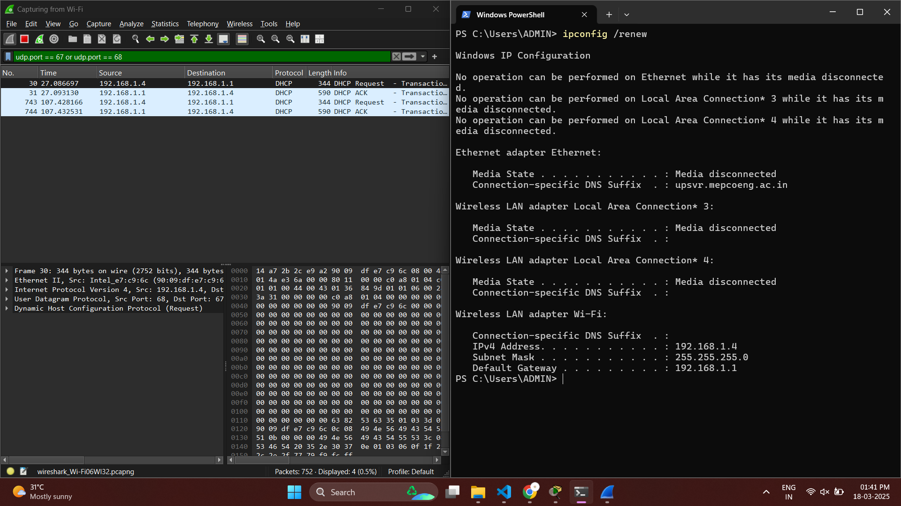

# Network Assignment - 3 & 4

#### Shiva Raama Krishna.K

#### Mepco Schlenk Engineering College

#### Dept. of Computer Science and Engineering

## Question - 01

### Capture and analyze ARP packets using Wireshark. Inspect the ARP request and reply frames, and discuss the role of the sender's IP and MAC address in these packets.

In an ARP request packet, the sender's IP and MAC addresses identify the device making the request, while the target IP address specifies the device it wants to communicate with.

The sender's MAC address is included so that the target device knows where to send the ARP reply. In an ARP reply packet, the target device responds by providing its MAC address, mapping it to the requested IP.

This exchange allows the sender to update its ARP table and establish direct communication at the data link layer. Without this, devices would be unable to resolve MAC addresses, preventing local network communication.


## Question - 02

### Using Packet Tracer, simulate an ARP spoofing attack. Analyze the behavior of devices on the network when they receive a malicious ARP response.


## Question - 03

### Manually configure static IPs on the client devices(like Pc or your mobile phone) and verify connectivity using ping.


## Question - 04

### Use Wireshark to capture DHCP Discover, Offer, Request, and Acknowledge messages and explain the process.

The DHCP process follows four steps called DORA: Discover, Offer, Request, and Acknowledge. When a device connects to a network, it first sends a DHCP Discover message to find a DHCP server. The server responds with a DHCP Offer, providing an available IP address. The device then sends a DHCP Request to confirm its selection of the offered IP. Finally, the server sends a DHCP Acknowledge, confirming the lease and assigning the IP to the device.




## Question - 05

### Given an IP address range of 192.168.1.0/24, divide the network into 4 subnets. Task: Manually calculate the new subnet mask and the range of valid IP addresses for each subnet. Assign IP addresses from these subnets to devices in Cisco Packet Tracer and verify connectivity using ping between them.

# Subnetting a /24 Network into 4 Equal Subnets

## Original Network:
- **Network Address:** 192.168.1.0/24  
- **Number of Subnets Needed:** 4  
- **Bits Borrowed:** 2 bits (2² = 4)  
- **New Prefix Length:** /26  
- **New Subnet Mask:** 255.255.255.192  

## Subnet Details:
| Subnet | Network Address  | First Usable IP  | Last Usable IP   | Broadcast Address |
|--------|----------------|-----------------|-----------------|------------------|
| 1      | 192.168.1.0    | 192.168.1.1     | 192.168.1.62    | 192.168.1.63    |
| 2      | 192.168.1.64   | 192.168.1.65    | 192.168.1.126   | 192.168.1.127   |
| 3      | 192.168.1.128  | 192.168.1.129   | 192.168.1.190   | 192.168.1.191   |
| 4      | 192.168.1.192  | 192.168.1.193   | 192.168.1.254   | 192.168.1.255   |

## Calculation Details:
- **Subnet Mask in Binary:** `11111111.11111111.11111111.11000000`  
- **Subnet Mask in Decimal:** `255.255.255.192`  
- **Number of Hosts per Subnet:** `2^6 - 2 = 62 hosts`  
- **Subnet Increment:** `64 (256 ÷ 4)`  
- **Each Subnet Provides:** `62 Usable IPs (excluding network and broadcast addresses)`  


## Question - 06

### You are given three IP addresses: 10.1.1.1, 172.16.5.10, and 192.168.1.5.

### Task: Identify the class of each IP address (Class A, B, or C).

### What is the default subnet mask for each class?

### Provide the range of IP addresses for each class.

| **IP Address** | **Class** | **Default Subnet Mask** | **IP Address Range**          |
| -------------- | --------- | ----------------------- | ----------------------------- |
| 10.1.1.1       | Class A   | 255.0.0.0               | 10.0.0.0 – 10.255.255.255     |
| 172.16.5.10    | Class B   | 255.255.0.0             | 172.16.0.0 – 172.31.255.255   |
| 192.168.1.5    | Class C   | 255.255.255.0           | 192.168.0.0 – 192.168.255.255 |

## Question - 07

### In Cisco Packet Tracer, create a small network with multiple devices (e.g., 2 PCs and a router). Use private IP addresses (e.g., 192.168.1.x) on the PCs and configure the router to perform NAT to allow the PCs to access the internet. Task: Test the NAT configuration by pinging an external IP address from the PCs and capture the traffic using Wireshark. What is the source IP address before and after NAT?

```bash
Router(config)#interface GigabitEthernet0/0
Router(config-if)#ip address 192.168.1.1 255.255.255.0
Router(config-if)#no shutdown
Router(config-if)#exit
Router(config)#interface GigabitEthernet0/1
Router(config-if)#no shutdown

Router(config-if)#
%LINK-5-CHANGED: Interface GigabitEthernet0/1, changed state to up

%LINEPROTO-5-UPDOWN: Line protocol on Interface GigabitEthernet0/1, changed state to up

Router(config-if)#exit
Router(config)#interface GigabitEthernet0/0
Router(config-if)#ip nat inside
Router(config-if)#
Router(config-if)#exit
Router(config)#interface GigabitEthernet0/1
Router(config-if)#ip nat outside
Router(config-if)#exit
Router(config)#end
Router#
%SYS-5-CONFIG_I: Configured from console by console
```


