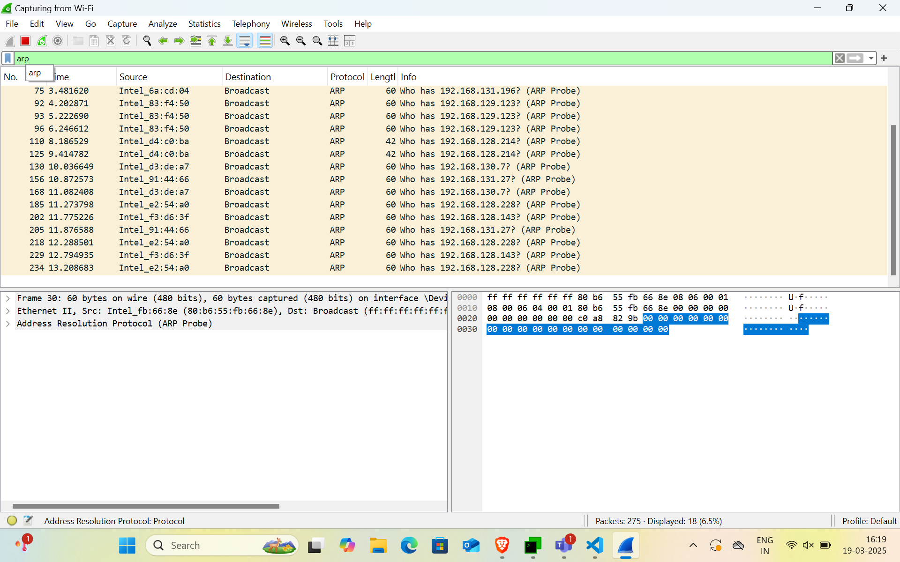
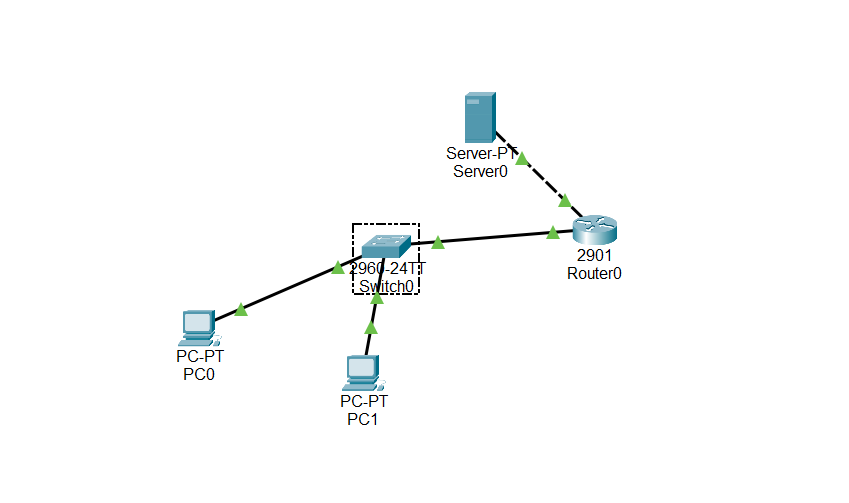

# Network Assignment - 01

#### Shiva Raama Krishna.K
#### Mepco Schlenk Engineering College
#### Dept. of Computer Science and Engineering

## Question - 01

### Capture and analyze ARP packets using Wireshark. Inspect the ARP request and reply frames when your device attempts to find the router's MAC address. Discuss the importance of ARP in packet forwarding

First create multiple files 



## Question - 02

### Manually configure static routes on a router to direct packets to different subnets. Use the ip route command and verify connectivity using ping and traceroute.

Putting files in FTP using PUT command


Retrieving files in FTP using GET command


## Question - 03

### Given a network address of 10.0.0.0/24, divide it into 4 equal subnets. Calculate the new subnet mask. Determine the valid host range for each subnet. Assign IP addresses to devices in Packet Tracer and verify connectivity.

To divide the 10.0.0.0/24 network into 4 equal subnets, we borrow 2 bits from the host portion, giving a new subnet mask of /26 (255.255.255.192). The four subnets are:

10.0.0.0/26 (Hosts: 10.0.0.1 - 10.0.0.62, Broadcast: 10.0.0.63) 10.0.0.64/26 (Hosts: 10.0.0.65 - 10.0.0.126, Broadcast: 10.0.0.127) 10.0.0.128/26 (Hosts: 10.0.0.129 - 10.0.0.190, Broadcast: 10.0.0.191) 10.0.0.192/26 (Hosts: 10.0.0.193 - 10.0.0.254, Broadcast: 10.0.0.255)

## Question - 04

### You are given three IP addresses: 192.168.10.5, 172.20.15.1, and 8.8.8.8. Identify the class of each IP address. Determine if it is private or public. Explain how NAT would handle a private IP when accessing the internet.

The IP address 192.168.10.5 belongs to Class C (192.0.0.0 - 223.255.255.255) and is private, as it falls within the 192.168.0.0 - 192.168.255.255 range. The IP 172.20.15.1 is Class B (128.0.0.0 - 191.255.255.255) and is also private since it lies within the 172.16.0.0 - 172.31.255.255 range. The IP 8.8.8.8 is Class A (1.0.0.0 - 126.0.0.0) and is public, as it does not belong to any reserved private IP ranges. When a private IP (e.g., 192.168.10.5 or 172.20.15.1) accesses the internet, NAT (Network Address Translation) on a router or firewall translates the private IP into a public IP assigned by an ISP.

## Question - 05

### In Cisco Packet Tracer, configure NAT on a router to allow internal devices (192.168.1.x) to access the internet. Test connectivity by pinging an external public IP.



```bash

Cisco Packet Tracer PC Command Line 1.0
C:\>ping 192.168.1.1

Pinging 192.168.1.1 with 32 bytes of data:

Reply from 192.168.1.1: bytes=32 time<1ms TTL=255
Reply from 192.168.1.1: bytes=32 time<1ms TTL=255
Reply from 192.168.1.1: bytes=32 time<1ms TTL=255
Reply from 192.168.1.1: bytes=32 time<1ms TTL=255

Ping statistics for 192.168.1.1:
    Packets: Sent = 4, Received = 4, Lost = 0 (0% loss),
Approximate round trip times in milli-seconds:
    Minimum = 0ms, Maximum = 0ms, Average = 0ms

C:\>ping 192.168.1.3

Pinging 192.168.1.3 with 32 bytes of data:

Reply from 192.168.1.3: bytes=32 time<1ms TTL=128
Reply from 192.168.1.3: bytes=32 time<1ms TTL=128
Reply from 192.168.1.3: bytes=32 time<1ms TTL=128
Reply from 192.168.1.3: bytes=32 time<1ms TTL=128

Ping statistics for 192.168.1.3:
    Packets: Sent = 4, Received = 4, Lost = 0 (0% loss),
Approximate round trip times in milli-seconds:
    Minimum = 0ms, Maximum = 0ms, Average = 0ms

C:\>ping 200.0.02
Ping request could not find host 200.0.02. Please check the name and try again.
C:\>ping 200.0.0.2

Pinging 200.0.0.2 with 32 bytes of data:

Request timed out.
Reply from 200.0.0.2: bytes=32 time<1ms TTL=127
Reply from 200.0.0.2: bytes=32 time<1ms TTL=127
Reply from 200.0.0.2: bytes=32 time<1ms TTL=127

Ping statistics for 200.0.0.2:
    Packets: Sent = 4, Received = 3, Lost = 1 (25% loss),
Approximate round trip times in milli-seconds:
    Minimum = 0ms, Maximum = 0ms, Average = 0ms
```

```bash

Router>
Router>enable
Router#configure terminal
Enter configuration commands, one per line.  End with CNTL/Z.
Router(config)#interface GigabitEthernet0/0
Router(config-if)#ip address 192.168.1.1 255.255.255.0
Router(config-if)#ip nat inside
Router(config-if)#no shutdown

Router(config-if)#
%LINK-5-CHANGED: Interface GigabitEthernet0/0, changed state to up

%LINEPROTO-5-UPDOWN: Line protocol on Interface GigabitEthernet0/0, changed state to up
exit

Router(config)#interface GigabitEthernet0/1
Router(config-if)#ip address 200.0.0.1 255.255.255.0
Router(config-if)#ip nat outside
Router(config-if)#no shutdown

Router(config-if)#
%LINK-5-CHANGED: Interface GigabitEthernet0/1, changed state to up

%LINEPROTO-5-UPDOWN: Line protocol on Interface GigabitEthernet0/1, changed state to up
exit
Router(config)#ip nat inside source list 1 interface GigabitEthernet0/1 overload
Router(config)#
Router(config)#exit
Router#
%SYS-5-CONFIG_I: Configured from console by console

Router#exit
Router>enable
Router#show ip nat translations
Router#show ip interface brief
Interface              IP-Address      OK? Method Status                Protocol 
GigabitEthernet0/0     192.168.1.1     YES manual up                    up 
GigabitEthernet0/1     200.0.0.1       YES manual up                    up 
Vlan1                  unassigned      YES unset  administratively down down
Router#
Router#
Router#configure terminal
Enter configuration commands, one per line.  End with CNTL/Z.
Router(config)#ip route 0.0.0.0 0.0.0.0 GigabitEthernet0/1
%Default route without gateway, if not a point-to-point interface, may impact performance
Router(config)#ip route 0.0.0.0 0.0.0.0 200.0.0.2
Router(config)#exit
Router#
%SYS-5-CONFIG_I: Configured from console by console
show ip route
Codes: L - local, C - connected, S - static, R - RIP, M - mobile, B - BGP
       D - EIGRP, EX - EIGRP external, O - OSPF, IA - OSPF inter area
       N1 - OSPF NSSA external type 1, N2 - OSPF NSSA external type 2
       E1 - OSPF external type 1, E2 - OSPF external type 2, E - EGP
       i - IS-IS, L1 - IS-IS level-1, L2 - IS-IS level-2, ia - IS-IS inter area
       * - candidate default, U - per-user static route, o - ODR
       P - periodic downloaded static route

Gateway of last resort is 0.0.0.0 to network 0.0.0.0

     192.168.1.0/24 is variably subnetted, 2 subnets, 2 masks
C       192.168.1.0/24 is directly connected, GigabitEthernet0/0
L       192.168.1.1/32 is directly connected, GigabitEthernet0/0
     200.0.0.0/24 is variably subnetted, 2 subnets, 2 masks
C       200.0.0.0/24 is directly connected, GigabitEthernet0/1
L       200.0.0.1/32 is directly connected, GigabitEthernet0/1
S*   0.0.0.0/0 is directly connected, GigabitEthernet0/1
               [1/0] via 200.0.0.2

Router#configure terminal
Enter configuration commands, one per line.  End with CNTL/Z.
Router(config)#interface GigabitEthernet0/0
Router(config-if)#ip address 192.168.1.1 255.255.255.0
Router(config-if)#
Router(config-if)#exit
Router(config)#
Router(config)#
Router(config)#exit
Router#
%SYS-5-CONFIG_I: Configured from console by console

Router#show ip interface brief
Interface              IP-Address      OK? Method Status                Protocol 
GigabitEthernet0/0     192.168.1.1     YES manual up                    up 
GigabitEthernet0/1     200.0.0.1       YES manual up                    up 
Vlan1                  unassigned      YES unset  administratively down down
Router#

```