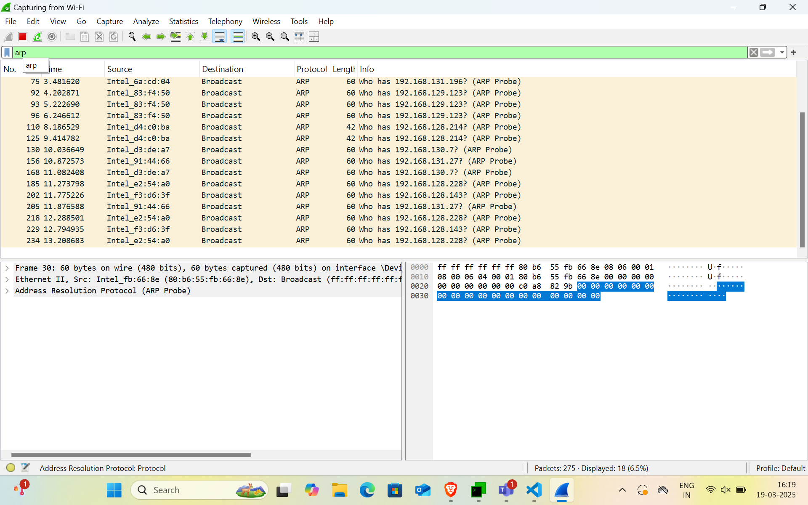
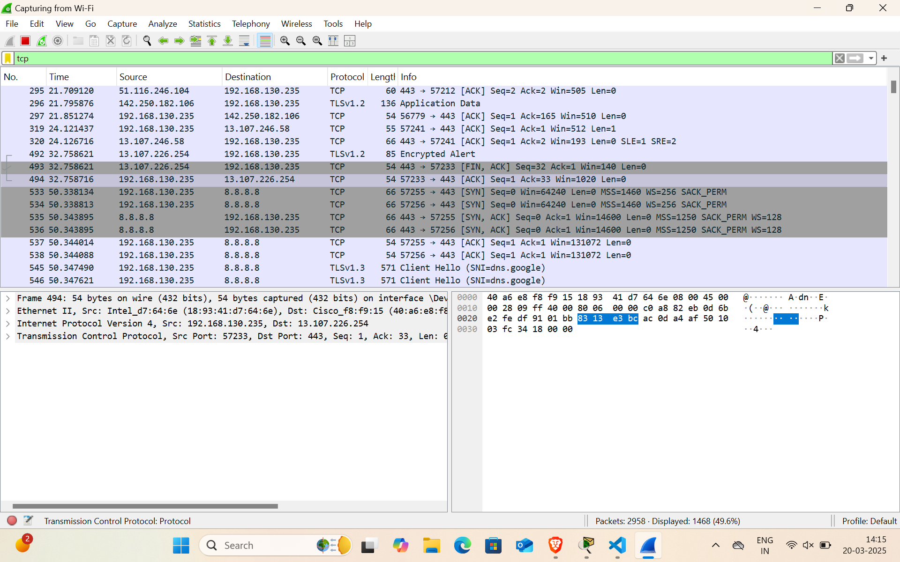
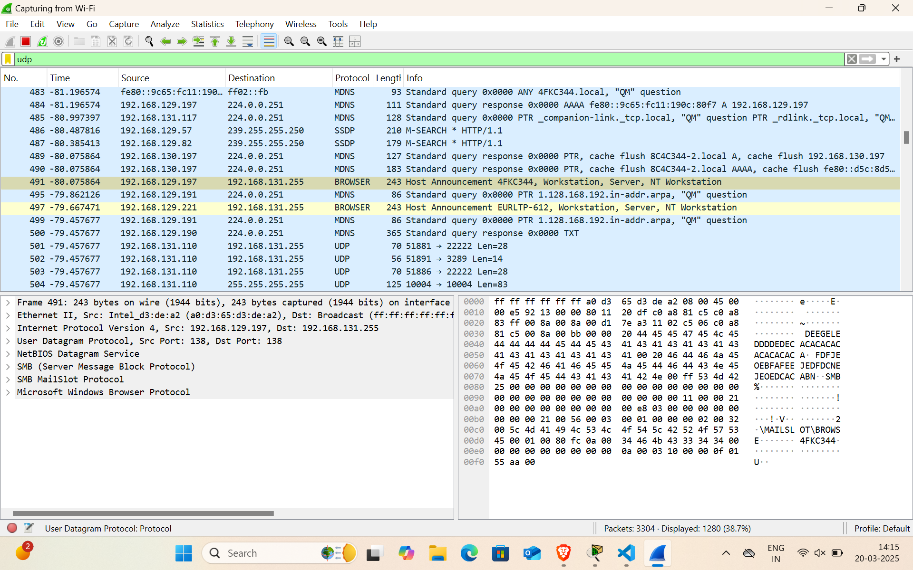

# Network Assignment - 01

#### Shiva Raama Krishna.K
#### Mepco Schlenk Engineering College
#### Dept. of Computer Science and Engineering

## Question - 01

### Capture and analyze ARP packets using Wireshark. Inspect the ARP request and reply frames when your device attempts to find the router's MAC address. Discuss the importance of ARP in packet forwarding

First create multiple files 

```Bash

PS C:\Users\Shiva rama krishna> Test-Connection www.google.com -Count 4

Source        Destination     IPV4Address      IPV6Address                              Bytes    Time(ms)
------        -----------     -----------      -----------                              -----    --------
EURLTP-597    www.google.com  142.250.189.196                                           32       354
EURLTP-597    www.google.com  142.250.189.196                                           32       227
EURLTP-597    www.google.com  142.250.189.196                                           32       330
EURLTP-597    www.google.com  142.250.189.196                                           32       216


PS C:\Users\Shiva rama krishna> Test-Connection www.facebook.com -Count 4

Source        Destination     IPV4Address      IPV6Address                              Bytes    Time(ms)
------        -----------     -----------      -----------                              -----    --------
EURLTP-597    www.facebook... 157.240.22.35                                             32       256
EURLTP-597    www.facebook... 157.240.22.35                                             32       264
EURLTP-597    www.facebook... 157.240.22.35                                             32       255
EURLTP-597    www.facebook... 157.240.22.35                                             32       256


PS C:\Users\Shiva rama krishna>  Test-Connection www.github.com -Count 4

Source        Destination     IPV4Address      IPV6Address                              Bytes    Time(ms)
------        -----------     -----------      -----------                              -----    --------
EURLTP-597    www.github.com  140.82.116.4                                              32       284
EURLTP-597    www.github.com  140.82.116.4                                              32       283
EURLTP-597    www.github.com  140.82.116.4                                              32       247
EURLTP-597    www.github.com  140.82.116.4                                              32       254


PS C:\Users\Shiva rama krishna> Test-Connection www.cisco.com -Count 4

Source        Destination     IPV4Address      IPV6Address                              Bytes    Time(ms)
------        -----------     -----------      -----------                              -----    --------
EURLTP-597    www.cisco.com   23.37.18.125                                              32       288
EURLTP-597    www.cisco.com   23.37.18.125                                              32       274
EURLTP-597    www.cisco.com   23.37.18.125                                              32       283
EURLTP-597    www.cisco.com   23.37.18.125                                              32       392


PS C:\Users\Shiva rama krishna> nslookup www.google.com
Server:  eur-dc2.embedur.local
Address:  192.168.16.4

Non-authoritative answer:
Name:    www.google.com
Addresses:  2607:f8b0:4005:80d::2004
          142.250.189.228

PS C:\Users\Shiva rama krishna> nslookup www.facebook.com
Server:  eur-dc2.embedur.local
Address:  192.168.16.4

Non-authoritative answer:
Name:    star-mini.c10r.facebook.com
Addresses:  2a03:2880:f131:83:face:b00c:0:25de
          157.240.22.35
Aliases:  www.facebook.com

PS C:\Users\Shiva rama krishna>  nslookup www.amazon.com
Server:  eur-dc2.embedur.local
Address:  192.168.16.4

Non-authoritative answer:
Name:    d3ag4hukkh62yn.cloudfront.net
Addresses:  2600:9000:2163:200:7:49a5:5fd4:b121
          2600:9000:2163:ea00:7:49a5:5fd4:b121
          2600:9000:2163:8a00:7:49a5:5fd4:b121
          2600:9000:2163:3200:7:49a5:5fd4:b121
          2600:9000:2163:f200:7:49a5:5fd4:b121
          2600:9000:2163:800:7:49a5:5fd4:b121
          2600:9000:2163:1000:7:49a5:5fd4:b121
          2600:9000:2163:cc00:7:49a5:5fd4:b121
          99.84.64.60
Aliases:  www.amazon.com
          tp.47cf2c8c9-frontier.amazon.com

PS C:\Users\Shiva rama krishna> nslookup www.github.com
Server:  eur-dc2.embedur.local
Address:  192.168.16.4

Non-authoritative answer:
Name:    github.com
Address:  140.82.116.4
Aliases:  www.github.com

PS C:\Users\Shiva rama krishna>  nslookup www.cisco.com
Server:  eur-dc2.embedur.local
Address:  192.168.16.4

Non-authoritative answer:
Name:    e2867.dsca.akamaiedge.net
Addresses:  2600:1406:3a00:78b::b33
          2600:1406:3a00:783::b33
          23.37.18.125
Aliases:  www.cisco.com
          www.cisco.com.akadns.net
          wwwds.cisco.com.edgekey.net
          wwwds.cisco.com.edgekey.net.globalredir.akadns.net

PS C:\Users\Shiva rama krishna>

```

## Question - 02

### Use Wireshark to capture and analyze DNS, TCP, UDP traffic and packet header, packet flow, options and flags








## Question - 03

### Explore traceroute/tracert for different websites eg:google.com and analyse the parameters in the output and explore different options for traceroute command

```bash
PS C:\Users\Shiva rama krishna> tracert google.com

Tracing route to google.com [142.250.191.78]
over a maximum of 30 hops:

  1     5 ms     5 ms     4 ms  192.168.128.1
  2    10 ms     7 ms     6 ms  192.168.139.67
  3    10 ms     8 ms     7 ms  static-201.140.16.61-tataidc.co.in [61.16.140.201]
  4    15 ms     5 ms     9 ms  142.250.171.162
  5    10 ms    43 ms     8 ms  142.251.227.217
  6     9 ms     9 ms     5 ms  142.251.230.70
  7    41 ms    40 ms    38 ms  142.250.63.171
  8    53 ms    41 ms    44 ms  142.251.252.215
  9    75 ms     *        *     192.178.108.22
 10   154 ms   217 ms   185 ms  142.251.250.172
 11   285 ms     *        *     72.14.238.229
 12   305 ms   287 ms   295 ms  142.251.68.53
 13   272 ms   344 ms   264 ms  74.125.253.148
 14   243 ms   223 ms   210 ms  192.178.105.107
 15   333 ms   314 ms   296 ms  142.251.224.33
 16   279 ms   299 ms   311 ms  nuq04s43-in-f14.1e100.net [142.250.191.78]

Trace complete.
PS C:\Users\Shiva rama krishna>
```

