# Network Assignment - 01

#### Shiva Raama Krishna.K
#### Mepco Schlenk Engineering College
#### Dept. of Computer Science and Engineering

## Question - 01

### Copying a Folder with Multiple Files to a Destination (SCP, cp)

First create multiple files 

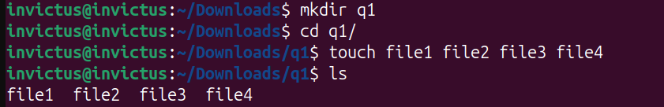

#### CP command

Moving those files using cp command. 

-r denotes recursive, which is used to move entire folders.

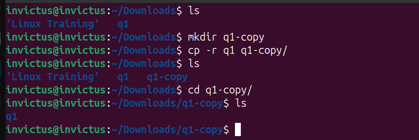

#### SCP command

connecting to a remote linux terminal 

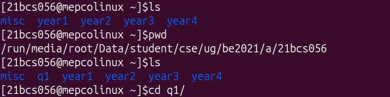

executing scp command and opening remote to check if files are properly sent

## Question - 02

### Host a FTP and SFTP server using PUT and GET commands.

#### FTP

Putting files in FTP using PUT command

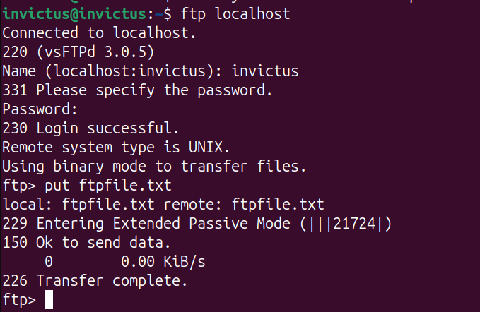

Retrieving files in FTP using GET command

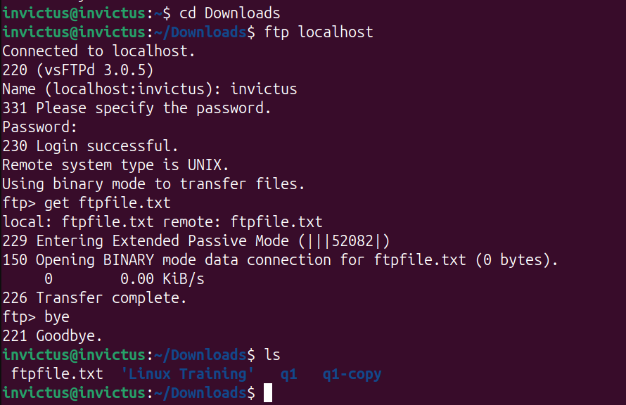

#### SFTP

Putting files in remote using SFTP

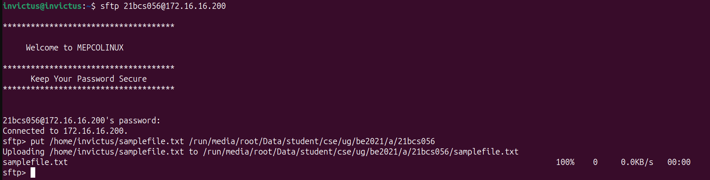

Putting files in remote using SFTP - result

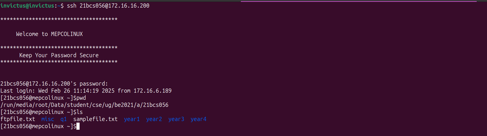

Retrieving files from remote using SFTP

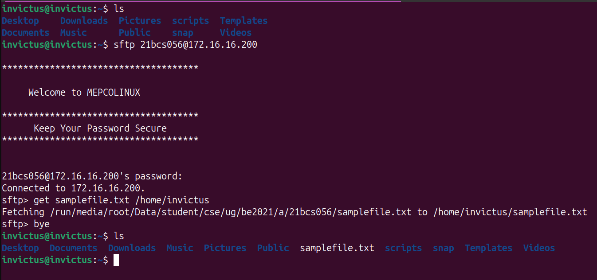

## Question - 03

#### Explore with Wireshark/TCP-dump/cisco packet tracer tools and learn about packets filters

Using wireshark to filter particular packets
searching all packets that are sent/received using ip (172.16.10.161)

## Question - 04

#### Understand linux utility commands like - ping, arp (Understand each params from ifconfig output)

arp command 

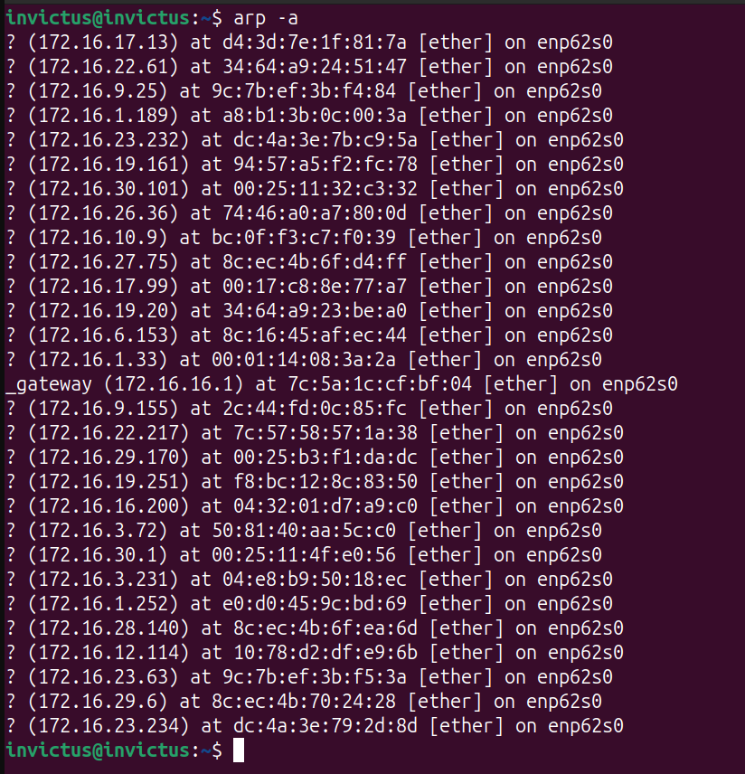

ifconfig command

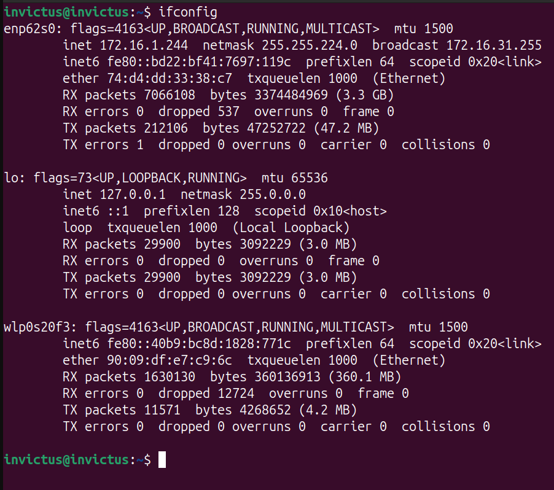

ping - google, ip

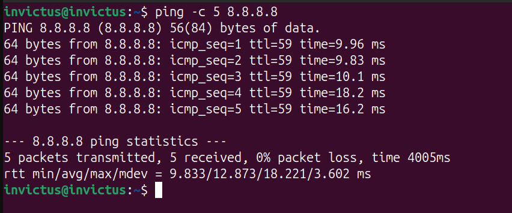

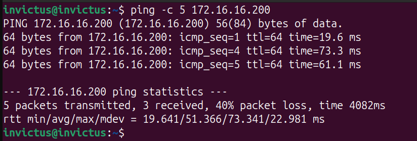

## Question - 05

#### Understand what happens when duplicate IPs configured in a network.

command to identify/filter duplicate IPs
 
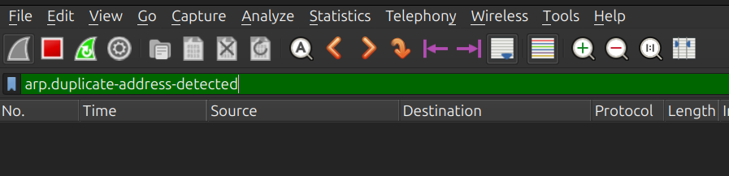

sample output of duplicate IPs configured in a network (using wireshark)

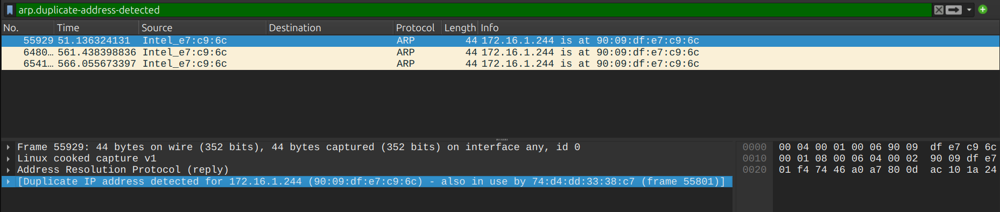

## Question - 06

#### Understand how to access remote system using (VNC viewer, Anydesk, teamviewer and remote desktop connections)

- Install Anydesk on both devices that are to be connected remotely
- The code that is generated on the remote device need to be entered on the host device
- The connection between remote and host device will be established. It can be used to control the remote device from the host. 

## Question - 07

#### How to check your default gateway is reachable or not and understand about default gateway.

In order to identify your default gateway
 

To check if the default gateway is reachable using ping command

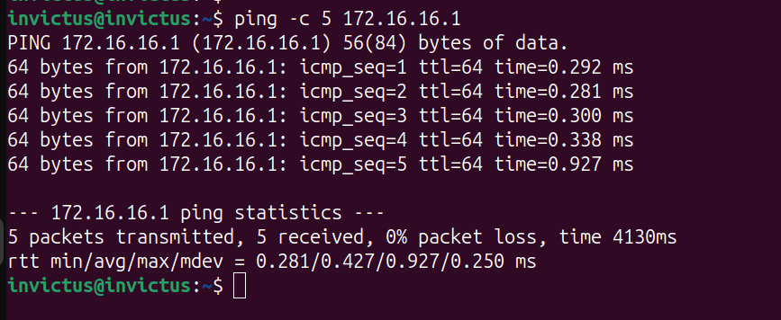

## Question - 08

#### Check iwconfig/ifconfig to understand in detail about network interfaces (check about interface speed, MTIJ and other parameters)

ifconfig command

## Question - 09

#### Log in to your home router's web interface (usually at 192.168.1.1 or 192.168.0.1) and check the connected devices list.

192.168.1.1 shows the home router's web interface 

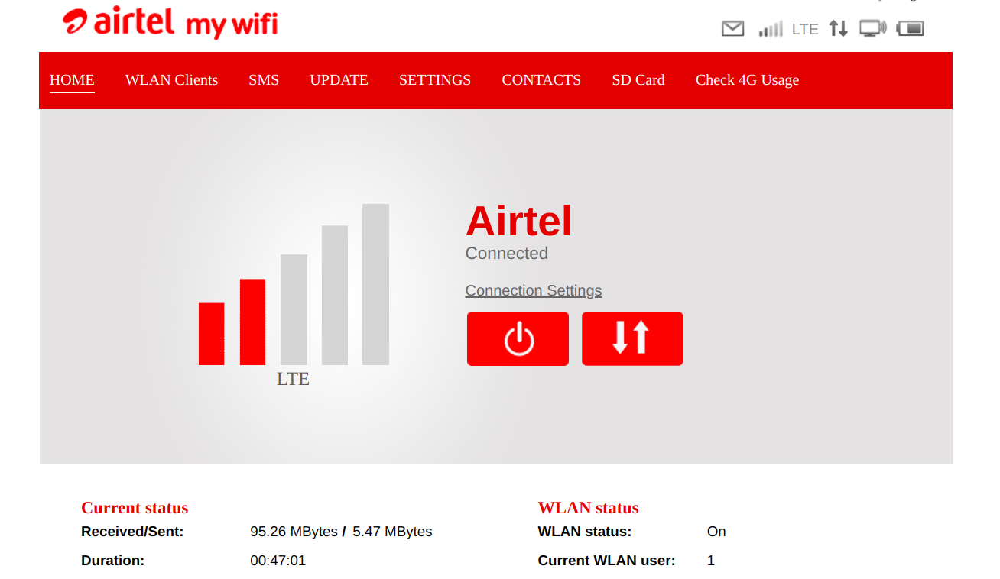

## Question - 10

#### Explain how a DHCP server assigns IP addresses to devices in your network.

DHCP assignes IP addresses to device based on the process of 

- DHCP Discover - Sent by the device as a broadcast to find a DHCP server.
- DHCP Offer - Sent by the DHCP server as a response to Discover message to offer an availabe IP to the device.
- DHCP Request - Sent by the client to the server to accept the Offer.
- DHCP Accept/Acknowledge - Sent by the server to Acknowledge the assignment.

## Question - 11

#### Using a terminal, connect to a remote machine via SSH and telnet.

Connecting to a remote machine using ssh
 
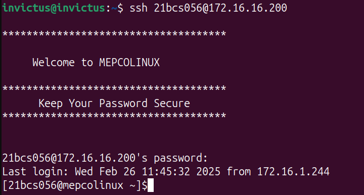
